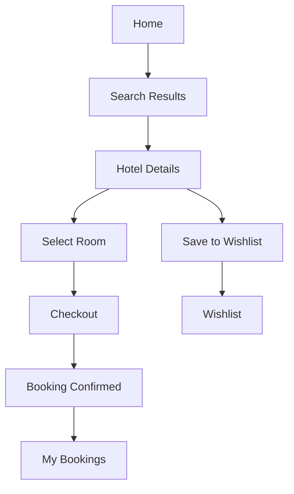

## 1. Product Overview
StayBee is a hotel discovery and booking web app focused on fast search, rich room details, and a frictionless booking flow.
It targets travelers who want to compare stays quickly and “lock in” a booking in minutes (demo booking—no payments).

## 2. Core Features

### 2.1 User Roles
| Role | Registration Method | Core Permissions |
|------|---------------------|------------------|
| Guest | None | Browse hotels, search/filter, view details, create a booking (stored locally) |
| Signed-in user (demo) | Email + password (local only) | All guest capabilities + view/cancel bookings + saved hotels |

### 2.2 Feature Modules
1. **Explore (Home)**: search, date picker, guests, location, featured collections, hotel cards
2. **Search Results**: filtering, sorting, map-less list view, pagination-like “load more”
3. **Hotel Details**: photo gallery, amenities, room list, policies, reviews (mock), “book now”
4. **Booking Checkout**: guest info, date summary, price breakdown, confirm booking
5. **Bookings**: list of upcoming/past bookings, cancel booking
6. **Saved (Wishlist)**: save/unsave hotels
7. **Auth (Demo)**: sign up / sign in (local, optional)

### 2.3 Page Details
| Page Name | Module Name | Feature description |
|-----------|-------------|---------------------|
| Home | Search bar | Location input, date range, guests, CTA to results |
| Home | Featured stays | Curated “collections” (mock) with quick filters |
| Results | Filters | Price range, rating, amenities, property type |
| Results | Sort | Price low/high, rating, “best value” |
| Details | Gallery | Responsive gallery with keyboard navigation |
| Details | Rooms | Room cards, occupancy, refundable badge, select room type |
| Checkout | Form | Guest info validation, summary sticky sidebar |
| Checkout | Confirmation | Booking ID generation, success screen |
| Bookings | Manage | Upcoming/past grouping, cancel flow, empty states |
| Saved | Wishlist | Saved hotels grid, quick remove |
| Auth | Demo auth | Local persistence, form validation, sign out |

## 3. Core Process
Main flows:
- User searches on Home → views Results → opens a Hotel → selects a Room → completes Checkout → sees confirmation → manages bookings.
- User can save hotels to Wishlist from cards or details.

## 4. User Interface Design

### 4.1 Design Style
- Theme direction: “urban honey + night ink” (warm amber accents on deep neutral surfaces)
- Primary color: near-black/ink background with warm honey accent
- Secondary color: cool slate for borders/text hierarchy
- Buttons: rounded, slightly “pill” primary actions; subtle sheen gradient; strong hover transitions
- Typography: display serif for brand + headings; clean sans for body text (web-safe via Google Fonts)
- Layout: editorial card grid, big hero search, sticky summary on checkout, generous spacing
- Icon style: thin-line icons (lucide)

### 4.2 Page Design Overview
| Page Name | Module Name | UI Elements |
|-----------|-------------|-------------|
| Home | Hero | Large brand wordmark, prominent search bar, animated background texture |
| Results | Grid | Hotel cards with image, rating, price, “save” button, filter drawer |
| Details | Sections | Gallery, amenities chips, room cards, policy accordion |
| Checkout | Summary | Sticky price breakdown card, clear step headings, validation states |
| Bookings | Lists | Timeline-like booking cards, status badges, cancel confirmation |

### 4.3 Responsiveness
- Desktop-first with responsive grid breakpoints
- Touch-friendly controls on mobile (larger tap targets, sticky bottom CTA on details)
- Accessible focus rings and keyboard navigation across modals and forms
