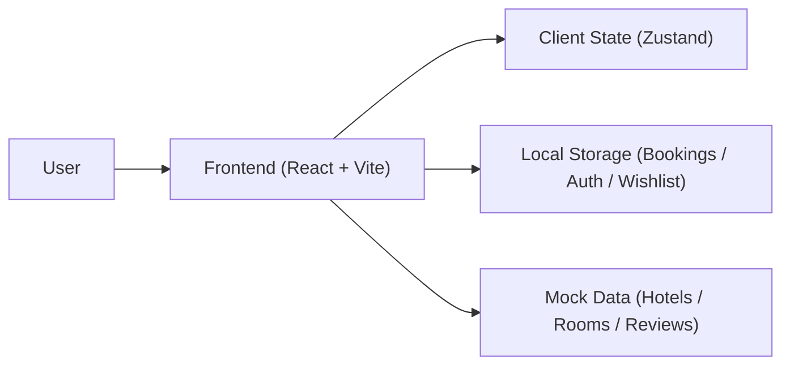
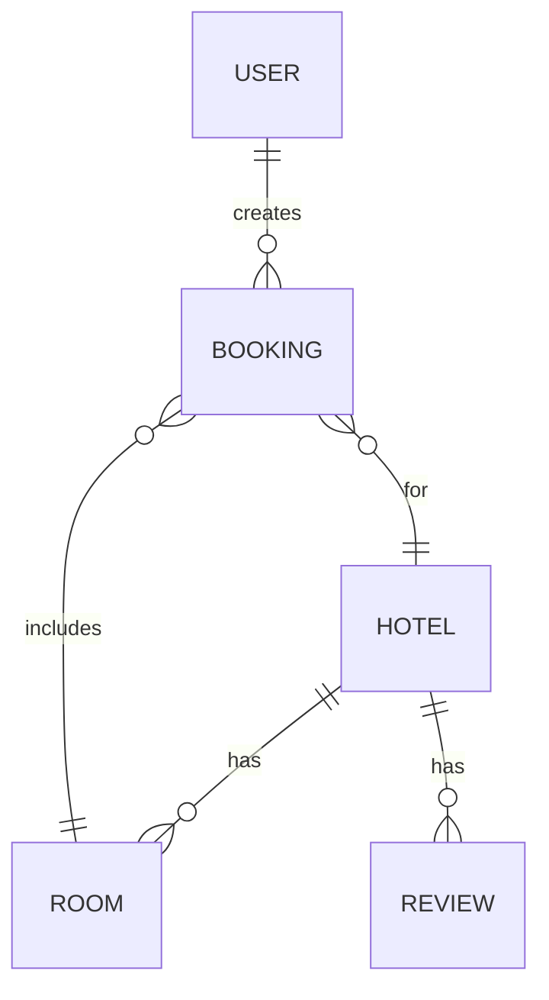

## 1. Architecture Design

## 2. Technology Description
- Frontend: React@18 + TypeScript + vite + tailwindcss
- Routing: react-router-dom
- State: zustand (search parameters, user session, wishlist, bookings)
- Icons: lucide-react
- Data: static mock dataset in the repo + localStorage for user-generated data
- Backend: None (demo app). Future extension: Vercel Serverless Functions for availability/pricing.

## 3. Route Definitions
| Route | Purpose |
|-------|---------|
| / | Home (hero search + featured stays) |
| /search | Search results with filters and sorting |
| /hotels/:hotelId | Hotel details, rooms, reviews, booking CTA |
| /checkout | Checkout form + booking confirmation |
| /bookings | My bookings list + cancel booking |
| /saved | Wishlist (saved hotels) |
| /auth | Demo sign in / sign up |

## 4. API Definitions
No backend APIs in v1.

In-app “service layer” functions (frontend only):
- `searchHotels(params)` → filters/sorts mock data
- `getHotelById(hotelId)` → reads from mock dataset
- `createBooking(input)` → validates and persists to localStorage
- `cancelBooking(bookingId)` → updates localStorage

TypeScript data shapes:
- `Hotel`: id, name, location, images, rating, priceFrom, amenities, rooms
- `Room`: id, name, occupancy, refundable, pricePerNight, images
- `Booking`: id, hotelId, roomId, dateRange, guests, guestInfo, totalPrice, status, createdAt

## 5. Data Model

### 5.1 Data Model Definition

### 5.2 Storage Strategy
- `mock-data.json`: shipped with the app (read-only)
- `localStorage["staybee_session"]`: demo auth session info
- `localStorage["staybee_wishlist"]`: array of hotel IDs
- `localStorage["staybee_bookings"]`: array of bookings

## 6. Deployment Notes (Vercel)
- Build: `npm run build`
- Output: static SPA (Vite)
- Vercel settings: Framework Preset “Vite” (or “Other” + build/output configuration)
- Client-side routing: configure rewrite to `index.html` for all routes
